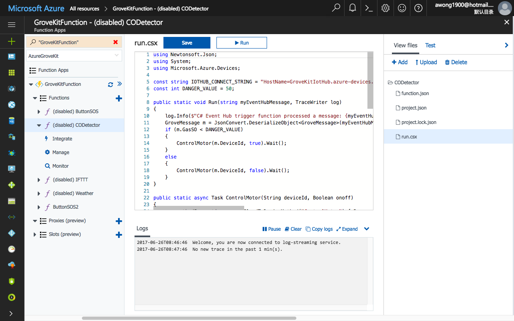

# Overview
Azure Functions is a serverless compute service that enables you to run code on-demand without having to explicitly provision or manage infrastructure.

We can use fuction to do logic process, and connect to third service.

## Setup Function App
First, create function app on "All resources --> New --> Compute --> Function App"
Refer to: https://docs.microsoft.com/en-us/azure/azure-functions/functions-create-first-azure-function

## Create CODetector function example
1. Copy IoTHub campatible EventHub endpoint name.
  Move on "Your_IoTHub --> GroveKitIotHub --> Endpoints --> Built-in endpoints", Click "messages/events", copy value of "Event Hub-compatible name". And add another Consumer groups, named "function".
2. Move on Fucntion App, Click add, choice "EventHubTrigger - C#" template. 
  Why we choice EventHubTigger intead of IoThubTrigger? Because Azure Function do not have IoThubTrigger template and IoTHub have a compatible EventHub endpoint.
3. Enter "CODetector" on "Name your function"
4. Enter Event Hub name from step 1 
6. Click "Integrate", modify value of "Event Hub consumer group" is "function"
5. Copy "Function/run.csx" to Azrue portal 
6. Modify IOTHUB_CONNECT_STRING on the run.csx
6. On the right side to add file named "project.json", copy "Function/project.json"
7. Now, You can run AzureGroveKit UWP app to test function.

## Function local test
See https://github.com/Seeed-Studio/AzureGroveKit/tree/master/FunctionTest
