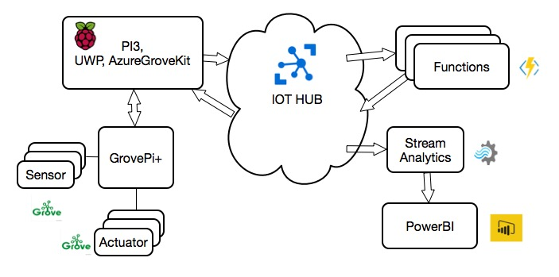
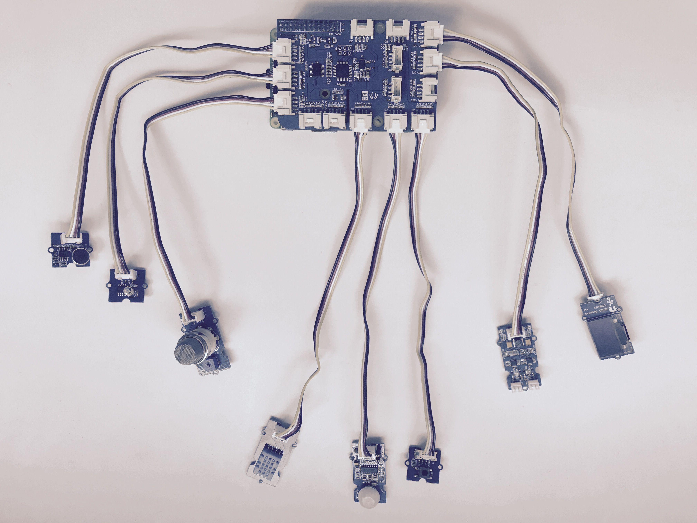

# Overview
The full name is "Grove Kit for Win10 Iot Core & Azure Platform". This Kit and Guide book will help quickly familiar win10 Iot and Azure. The hardware party is very to use. We make several classic scenes project.

# GetStarted
## Setup your rasaberry
### Install Win10 IoT Core
The SD Card included kit have installed the NBOOS system. It will guide you to install the latest Win10 IOT system from the Internet.
1. Put SD Card on Rasaberry
1. Connect display with your rasaberry, HDMI or lvds output.
2. Power on 
3. Connect WI-FI to internet
4. Choice Win10 IoT, Waiting install success.

### Setup Azure IOTHUB Devices Connect String on TPM
1. Move on "TPM configuration"
2. Intall "Software TPM Emulator(NoSecurity), wating system restart.
3. Copy "Device Id", "Device Primary Key", "Hostname" on "TPM configuration --> Logical devices settings --> Logical device ID: 0 --> Azure IoT Hub Hostname, "Device Primary Key", "Hostname", Then save.

### Deploy AzureGroveKit UWP App
The app help to connect Azure iothub, collect Grove sensor value and control Grove output.
1. Wating Win10 IoT setup, Setting Wi-Fi, Remeber the IP Address
2. Open browser, login win10 iot core web console "http://192.168.190.178:8080", Account: Administrator, Password: p@ssw0rd
3. Move on "Apps --> Install app"
4. "App package" choice "UWP/AzureGroveKit/AppPackages/AzureGroveKit_[version]_Debug_Test/AzureGroveKit_[version]_arm_Debug.appxbundle"
5. "Certificate" choice "UWP/AzureGroveKit/AppPackages/AzureGroveKit_[version]_Debug_Test/AzureGroveKit_[version]_arm_Debug.cer"
6. "Dependency" choice one "UWP/AzureGroveKit/AppPackages/AzureGroveKit_[version]_Debug_Test/Dependencies/ARM", the click "Add dependency" to choice nexe.
5. "Deploy" click "GO", waiting a few minutes
6. Refresh, you can find AzureGroveKit on Apps row

### Test AzureGroveKit App
1. Power off rasaberry, Insert GrovePi module.
2. Insert necessary Grove on GrovePi, Connect map below:

  Grove| GrovePi Port
  -----| ------------
  D2   | Grove - Temp&Humi Sensor
  D3   | Grove - PIR Motion Sensor
  D4   | Grove – Button
  D5   | Grove - Relay
  A0   | Grove - Sound Sensor
  A1   | Grove - Light Sensor
  A2   | Grove - Gas Sensor
  I2C1 | Grove - OLED Display 0.96"
  I2C2 | Grove - Mini I2C Motor Driver
3. Power on and login web console "http://192.168.190.178:8080"
4. Move on "App Manager --> Apps", Run "AzureGroveKit"
5. The app will display on output, Click "Run", Now The App send message to IOTHUB, and can response command.
6. Check "YOUR IOTHUB --> Overview --> Usage", i will show the message count.
7. If you use windows, use [DeviceExplorer](https://github.com/Azure/azure-iot-sdk-csharp/tree/master/tools/DeviceExplorer) see more info.

## Create Azure IOTHUB 
1. Login "https://portal.azure.com/", if you havn't account, first signup.
2. Create "New --> Internet of Things --> IoT hub", detail refer to https://docs.microsoft.com/en-us/azure/iot-hub/iot-hub-create-through-portal
3. create a device, move on "All resources --> YOUR_IOTHUB --> Device Explorer --> Add Device", save
4. click the device, copy "Device Id", "Device Primary Key"
5. move on "YOUR_IOTHUB --> Overview", copy "Hostname"
